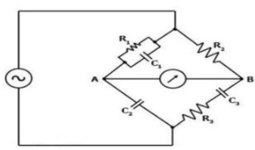
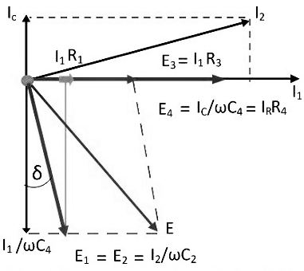
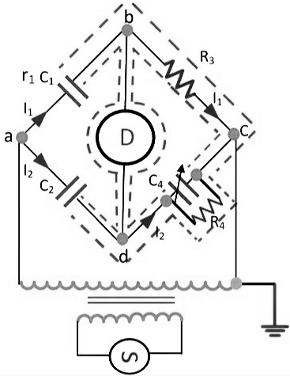

<head>

</head>

### Introduction

The Schering bridge use for measuring the capacitance of the capacitor, dissipation factor, properties of an insulator, capacitor bushing, insulating oil and other insulating materials. It is one of the most commonly used AC bridge. The Schering bridge works on the principle of balancing the load on its arm.  

 

**Fig. 1 Schering Bridge**

Let, C1 – capacitor whose capacitance is to be determined, 
r1 – a series resistance, representing the loss of the capacitor C1. 
C2 – a standard capacitor (The term standard capacitor means the capacitor is free from loss) 
R3 – a non-inductive resistance 
C4 – a variable capacitor 
R4 – a variable non-inductive resistance parallel with variable capacitor C4.

When the bridge is in the balanced condition, zero current passes through the detector, which shows that the potential across the detector is zero. At balance condition

$$\frac{Z1}{Z2} = \frac{Z3}{Z4}$$

$$Z1Z4 = Z2Z3$$

So,

$$ \left (r_1 + \frac{1}{jωC_1} \right ) \left (\frac{R_4}{1+jωC_4R_4} \right ) = \frac{1}{jωC_2}. R_3$$

$$ \left (r_1 + \frac{1}{jωC_1} \right )R_4 = \frac{R_3}{jωC_2}(1 + jωC_4R_4)$$

$$r_1R_4 - \frac{jR_4}{ωC_1} = -j\frac{R_3}{ωC_1} + \frac{R_3R_4C_4}{C_2}$$

Equating the real and imaginary equations, we get

$$r_1 = \frac{R_3C_4}{C_2}.......(1)$$

$$C_1 = C_2 \left (\frac{R_4}{R_3} \right ).........(2)$$

The equation (1) and (2) are the balanced equation, and it is free from the frequency.

The dissipation factor obtains with the help of the phasor diagram. The dissipation factor determines the rate of loss of energy that occurs because of the oscillations of the electrical and mechanical instrument.

 

**Fig. 2 Phasor Diagram of Schering Bridge**

$$D_1 = tanδ = ωC_1r_1 = ω(C_1r_1)$$

$$= ω \left (\frac{C_2R_4}{R_3} \right ) * \left (\frac{R_3C_4}{C_2} \right )$$

$$D_1 = ωC_4R_4$$

By the help of the above equation, we can calculate the value of tanδ which is the dissipation factor of the Schering bridge.

### High Voltage Schering Voltage
The low voltage Schering bridge has several disadvantages, and because of this reason, the high voltage and high frequency are required for measuring the small capacitance. The circuit diagram of the Schering bridge is shown in the figure below.

 

**Fig. 3 High Voltage Schering Bridge**

The following are the features of the Schering Bridge.

1. The high voltage supply obtains from the operational amplifier. The galvanometer use as a detector for the bridge.
2. The high voltage working capacitors are placed in the arms ab and ad. The impedance of the arm ab and ad are very high as compared to the arm bc and cd. The term impedance means the opposition offered by the circuit in the flow of current. The point c is earthed.
3. The impedance of the arm ab and ad is kept high so that the high supply will not affect the potential across the arm bc and cd. The potential across the detector is also kept low.
4. The spark gap sets places on each arm for preventing the dangerous high voltage which appears across the arm bc and dc because of the breakdown of the high voltage capacitors.
5. The power loss is very small in the arms ab and ad because of the high impedance of arms ab and ad.

### Advantages of Schering Bridge
The following are the advantages of the Schering bridge

1. Balance equations are free from frequency.
2. The arrangement of the bridge is less costly as compared to the other bridges.

### Applications of Schering Bridge
1. Schering's bridge is used to measure capacitance and dissipation factor of a capacitor.
2. This bridge is used for the measurement of the relative permittivity of dielectric materials.

