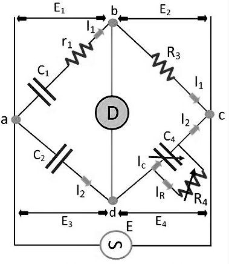

### Introduction
&nbsp;&nbsp;&nbsp;&nbsp;&nbsp;&nbsp;&nbsp;&nbsp;&nbsp;&nbsp;&nbsp;&nbsp; A Schering Bridge is a bridge circuit used for measuring an unknown electrical capacitance and its dissipation factor. The dissipation factor of a capacitor is the the ratio of its resistance to its capacitive reactance. The Schering Bridge is basically a four-arm alternating-current (AC) bridge circuit whose measurement depends on balancing the loads on its arms Figure 1 below shows a diagram of the Schering Bridge.  

### Diagram

 

**Fig. 1 Schering Bridge**

### Explanation
&nbsp;&nbsp;&nbsp;&nbsp;&nbsp;&nbsp;&nbsp;&nbsp;&nbsp;&nbsp;&nbsp;&nbsp;In the Schering Bridge above, the resistance values of resistors R1 and R2 are known, while the resistance value of resistor R3 is unknown. The capacitance values of C1 and C2 are also known, while the capacitance of C3 is the value being measured. To measure R3 and C3, the values of C2 and R2 are fixed, while the values of R1 and C1 are adjusted until the current through the ammeter between points A and B becomes zero. This happens when the voltages at points A and B are equal, in which case the bridge is said to be 'balanced'.

&nbsp;&nbsp;&nbsp;&nbsp;&nbsp;&nbsp;&nbsp;&nbsp;&nbsp;&nbsp;&nbsp;&nbsp;When the bridge is balanced, Z1/C2 = R2/Z3, where Z1 is the impedance of R1 in parallel with C1 and Z3 is the impedance of R3 in series with C3. In an AC circuit that has a capacitor, the capacitor contributes a capacitive reactance to the impedance. When the bridge is balanced, the negative and positive reactive components are equal and cancel out, so

&nbsp;&nbsp;&nbsp;&nbsp;&nbsp;&nbsp;&nbsp;&nbsp;&nbsp;&nbsp;&nbsp;&nbsp;Similarly, when the bridge is balanced, the purely resistive components are equal, so C2/C3 = R2/R1 or C3 = R1C2 / R2.

&nbsp;&nbsp;&nbsp;&nbsp;&nbsp;&nbsp;&nbsp;&nbsp;&nbsp;&nbsp;&nbsp;&nbsp;Note that the balancing of a Schering Bridge is independent of frequency.

### Advantages:
* Balance equation is independent of frequency.
* Used for measuring the insulating properties of electrical cables and equipment’s.

